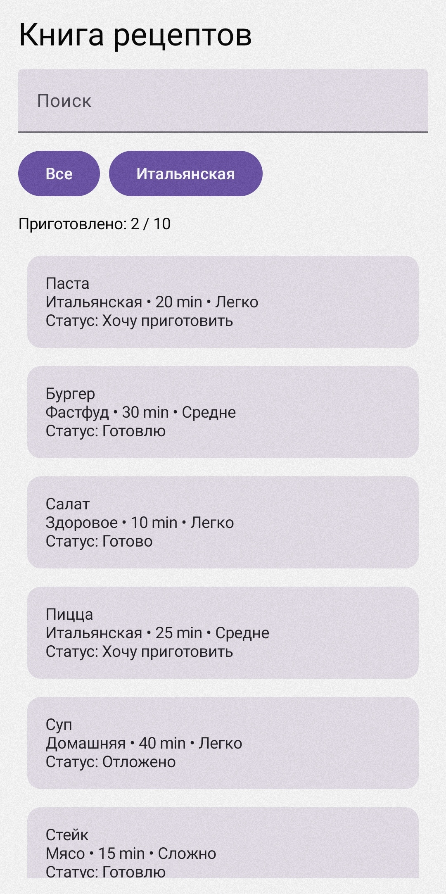

# Приложение "Книга рецептов"

## ФИО
Курышева Александра Александровна

## Группа
Б9124-09.03.03пикд(3)

## Тема приложения
Оффлайн приложение "Книга рецептов"

## Кратко суть
Приложение позволяет просматривать список рецептов, искать рецепты по названию, фильтровать по категории, открывать подробную информацию о рецепте и менять статус приготовления (Хочу приготовить, Готовлю, Готово, Отложено, Брошено)

## Скриншоты

